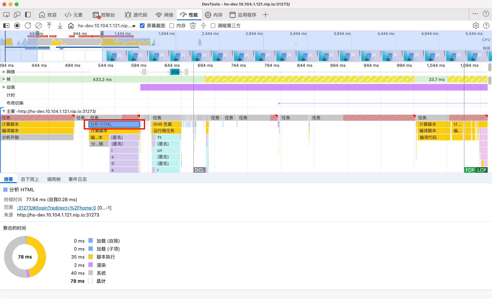

# Constructing the Object Model

We need to ensure that we deliver both the HTML and CSS to the browser as quickly as possible.

## Summary
- Bytes → characters → tokens → nodes → object model.
- HTML markup is transformed into a Document Object Model (DOM); CSS markup is transformed into a CSS Object Model (CSSOM).
- DOM and CSSOM are independent data structures.
- Chrome DevTools Performance panel allows us to capture and inspect the construction and processing costs of DOM and CSSOM.

## Document Object Model (DOM)

```html
<!DOCTYPE html>
<html>
  <head>
    <meta name="viewport" content="width=device-width,initial-scale=1" />
    <link href="style.css" rel="stylesheet" />
    <title>Critical Path</title>
  </head>
  <body>
    <p>Hello <span>web performance</span> students!</p>
    <div></div>
  </body>
</html>
```

Start with the simplest possible case: a plain HTML page with some text and a single image. How does the browser process this page?


1. **Conversion**: The browser reads the raw bytes of HTML off the disk or network, and translates them to individual characters based on specified encoding of the file (for example, UTF-8).
2. **Tokenizing**: The browser converts strings of characters into distinct tokens—as specified by the W3C HTML5 standard for example, `<html>`, `<body>`—and other strings within angle brackets. Each token has a special meaning and its own set of rules.
3. **Lexing**: The emitted tokens are converted into "objects," which define their properties and rules.
4. **DOM construction**: Finally, because the HTML markup defines relationships between different tags (some tags are contained within other tags) the created objects are linked in a tree data structure that also captures the parent-child relationships defined in the original markup: the HTML object is a parent of the body object, the body is a parent of the paragraph object, until the entire representation of the document is built.


**The final output of this entire process is the Document Object Model (DOM) of our simple page, which the browser uses for all further processing of the page.**

Every time the browser processes HTML markup, it goes through all of the previously defined steps: convert bytes to characters, identify tokens, convert tokens to nodes, and build the DOM tree. This entire process can take some time, especially if we have a large amount of HTML to process.



The DOM tree captures the properties and relationships of the document markup, but it doesn't tell us how the element will look when rendered. That’s the responsibility of the CSSOM.

## CSS Object Model (CSSOM)

While the browser was constructing the DOM of our basic page, it encountered a <link> element in the <head> of the document referencing an external CSS style sheet: style.css. Anticipating that it needs this resource to render the page, it immediately dispatches a request for this resource, which comes back with the following content:

```css
body {
  font-size: 16px;
}

p {
  font-weight: bold;
}

span {
  color: red;
}

p span {
  display: none;
}

img {
  float: right;
}
```

cssom-construction-steps:

