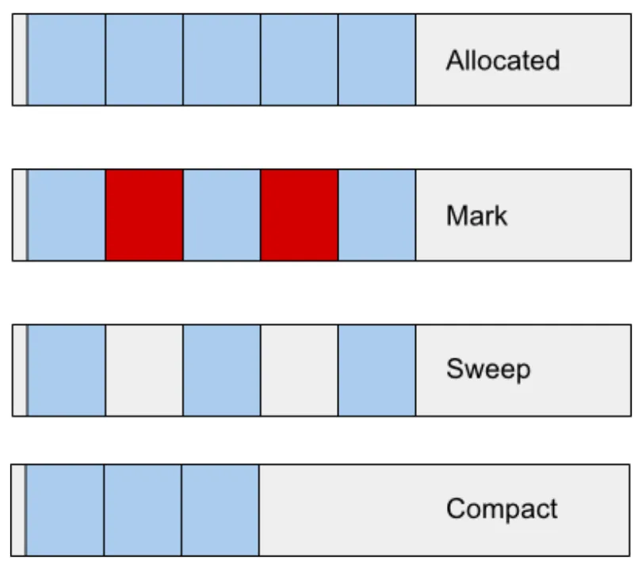
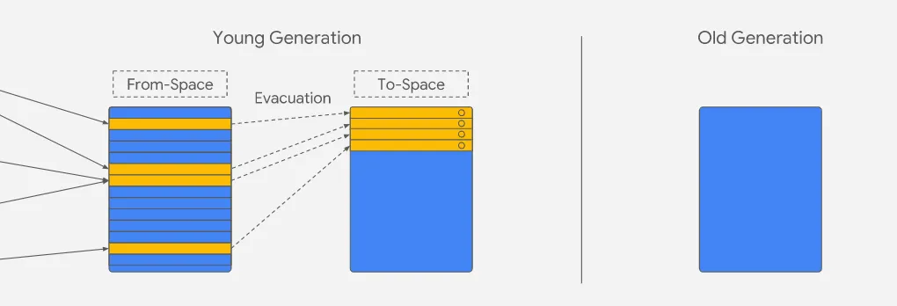
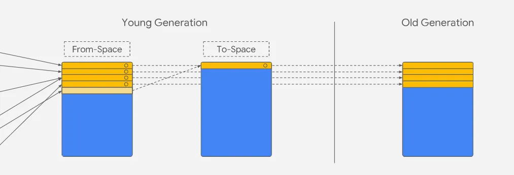
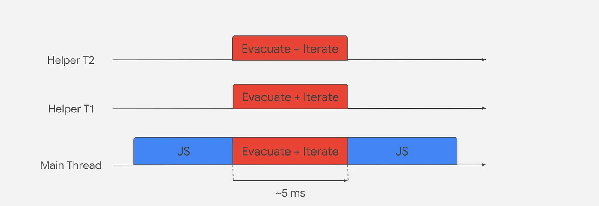
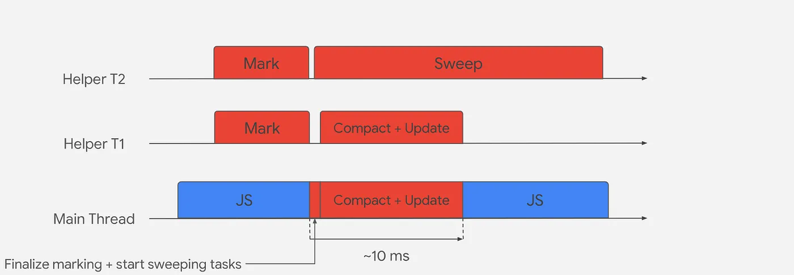

Garbage Collection is the process of tracking live objects while destroying unreferenced objects in the heap memory to make room for new objects that will be created in the future.

The V8 garbage collector has a few essential tasks that it has to do periodically:

1. Identify live objects.
2. Recycle/reuse the memory occupied by dead objects.
3. Compact/defragment memory. (Depends on scenario of the GC)

The V8 heap is divided into two main groups: a young generation, which is further split into the nursery and intermediate sub-generations, and an old generation. When objects are first created, they are placed in the nursery. If they survive the next garbage collection, they are moved to the intermediate sub-generation of the young generation. If they survive another garbage collection, they are moved into the old generation.

Each generation has a different algorithm that works on top of it to clean the garbage.

1. Young Generation — Minor GC (Scavenger)
2. Old Generation — Major GC (Full Mark-Compact)

Before I explain how the two algorithms work, there is a hypothesis that is very important to write.

> Generational Hypothesis: Infant mortality or the generational hypothesis is the observation that, in most cases, young objects are much more likely to die than old objects.

This basically states that most objects die young. Most objects are allocated and then almost immediately become unreachable, from a garbage collection perspective. This is true for most dynamic languages.

## Major Garbage Collector - Full Mark Compact

The Major GC collects garbage from the whole heap.

### Marking

The marking process involves identifying reachable objects. The garbage collector begins with a set of known object pointers, known as the root, which includes the execution stack and global object. It then follows each pointer to the next reachable object and marks it as such. This process continues recursively until every reachable object in the runtime has been found and marked.

### Sweeping

Sweeping is the process of identifying and filling gaps in memory left by dead objects by adding them to a data structure called a “Free List”. Once the garbage collector has finished marking unreachable objects, it locates contiguous gaps and adds them to the “Free List” for easy access. When we need to allocate memory, we can quickly check the “Free List” data structure to find an appropriate chunk of available memory.

### Compaction

In some cases, the garbage collector uses a fragmentation heuristic to decide which pages to compact. The surviving objects are then copied into pages that are not being compacted using the “Free List” for that page. By doing so, we are able to reuse the small and scattered gaps in memory that were left behind by dead objects.

## Minor Garbage Collector - Scavenger

The Minor GC collects garbage in the young generation.

As seen in the image of the “Young and Old generations structure,” there are “Nursery” and “Intermediate” areas. We divide these two areas into “From-Space” (Nursery) and “To-Space” (Intermediate).

During the allocation of objects, they are placed in “From-Space,” and when the Scavenger algorithm is initiated, objects are moved to “To-Space.” In the worst case scenario, every object could survive the scavenging phase, requiring every object to be copied, which means that half of the total space is always empty.

> For scavenging, we have an extra set of roots that are the old-to-new references. These are pointers in old-space that point to objects in the young generation. Instead of tracing the entire heap graph for each scavenge, these are combined with the stack and globals and that’s how we know every reference into the young generation without having to trace through the entire old generation.
>
> 这里看不懂可以看 [scavenger-plus.md](./scavenger-plus.md)

The scavenger step moves all surviving objects to a contiguous chunk of memory (Gaps left by dead objects are overridden by live objects and in the bytes of the memory). We then switch around the two spaces i.e. To-Space becomes From-Space and vice-versa. Once the garbage collection is completed, new allocations happen at the next free address in the From-Space.

With this strategy alone, we quickly run out of space in the young generation. Objects that survive a second garbage collection are moved into the old generation instead of To-Space. Then, we update the pointers that reference the original objects which have been moved. Every copied object leaves a forwarding address which is used to update the original pointer to point to the new location.

In scavenging, 3 things are happening. Marking, moving, and pointer-updating. All together.

## How the algorithms work from an operating system perspective

### Scavenger (Minor GC)

During the young generation garbage collection process, V8 uses parallel scavenging to distribute work across multiple helper threads. Each thread is assigned a certain number of pointers to follow and eagerly evacuates any live objects it encounters into the To-Space. However, the scavenging tasks must coordinate with each other through atomic read/write/compare-and-swap operations when attempting to evacuate an object.

### Full Mark Compact (Major GC)

During the old generation garbage collection process, V8 begins with concurrent marking. As the heap approaches a limit that is calculated dynamically, concurrent marking tasks are initiated. Each helper is assigned a number of pointers to follow, and they mark each object they encounter while tracing all references from discovered objects. Concurrent marking takes place in the background while JavaScript is executing on the main thread.

Once the concurrent marking is complete or we reach the dynamic allocation limit, the main thread performs a quick marking finalization step. This causes the main thread to pause, and this pause represents the total pause time of the major GC. The main thread then scans the roots again to ensure that all live objects are marked, and then starts parallel compaction and pointer updating with the help of several helpers. Not all pages in old-space can be compacted, so the ones that are not eligible will be swept using the previously mentioned free-lists. During the pause, the main thread also starts concurrent sweeping tasks that run concurrently with the parallel compaction tasks and the main thread itself. These tasks can continue even when JavaScript is running on the main thread.

