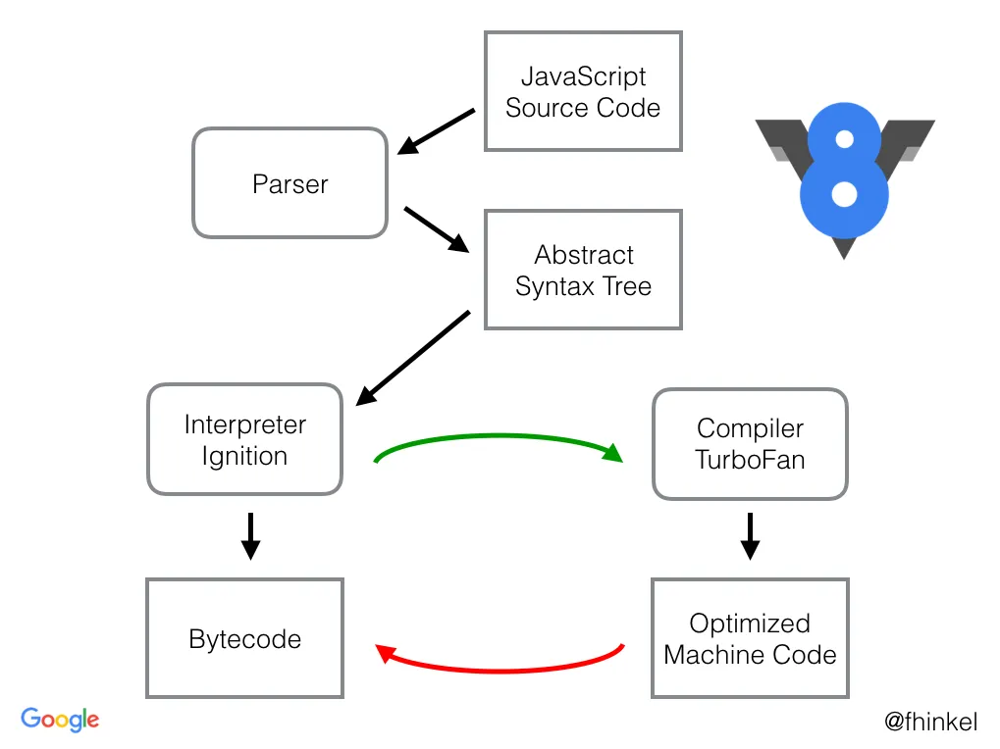

# How V8 compiles JavaScript code ?

V8 is a high-performance, open-source JavaScript and WebAssembly engine used by Google Chrome and Node.js. In this article, we will be going to see what happens behind the scene of V8 Architecture.

There are basically three steps involved in processing the code:

- Parsing the code
- Compiling the code
- Executing the code

## 1. Parsing Phase

During the parsing phase, the code is broken down into its respective tokens.

Example:

```javascript
const sum = 5 + 7
```

Here const is a token, sum is a token, 5 is a token, ‘+’ is a token, and 7 is a token. After the code is broken down into tokens, it is given to the syntax parser which converts the code into an Abstract Syntax Tree (AST).

Below is the generated AST for the above Example:

```json
{
  "type": "Program",
  "start": 0,
  "end": 17,
  "body": [
    {
      "type": "VariableDeclaration",
      "start": 0,
      "end": 17,
      "declarations": [
        {
          "type": "VariableDeclarator",
          "start": 6,
          "end": 17,
          "id": {
            "type": "Identifier",
            "start": 6,
            "end": 9,
            "name": "sum"
          },
          "init": {
            "type": "BinaryExpression",
            "start": 12,
            "end": 17,
            "left": {
              "type": "Literal",
              "start": 12,
              "end": 13,
              "value": 5,
              "raw": "5"
            },
            "operator": "+",
            "right": {
              "type": "Literal",
              "start": 16,
              "end": 17,
              "value": 7,
              "raw": "7"
            }
          }
        }
      ],
      "kind": "const"
    }
  ],
  "sourceType": "module"
}
```

## 2. Compilation phase

Compilation is the process of converting human-readable code to machine code. There are two ways to compile the code : 

- **Using an Interpreter**: The interpreter scans the code line by line and converts it into byte code. Example: Python
- **Using a Compiler**: The Compiler scans the entire document and compiles it into highly optimized byte code. Example: Java

Unlike other languages, The V8 engine uses **both a compiler and an interpreter** and follows **Just in Time(JIT) Compilation** for improved performance.

### Just in Time(JIT) Compilation

The V8 engine initially uses an interpreter, to interpret the code. On further executions, the V8 engine finds patterns such as frequently executed functions, frequently used variables, and compiles them to improve performance. Suppose the performance degrades or the parameters passed to the function change their type, then the V8 simply decompiles the compiled code and falls back to the interpreter. 

**Example:**  If the compiler compiles a function assuming the data fetched from the API call is of type String, the code fails when the data received is of type object. In this case, the compiler de-compiles the code, falls back to the interpreter, and updates the feedback. The V8 engine uses the **Ignition** interpreter, which takes in the Abstract Syntax Tree as the input and gives the byte code as the output, which further proceeds to the execution phase. When the code is being interpreted, the compiler tries to talk with the interpreter to optimize the code. The V8 engine uses the **Turbofan** compiler, which takes the byte code from the interpreter and feedback(from the interpreter) as the input and gives the optimized machine code as the output.

## 3. Execution Phase

The byte code is executed by using the **Memory heap and the Call Stack** of the V8 engine’s runtime environment. **Memory Heap** is the place where all the variables and functions are assigned memory. **Call Stack** is the place where each individual functions, when called are pushed to the stack, and popped out after their execution. When the interpreter interprets the code, using an object structure, where the keys are the byte code and the values the functions which handle the corresponding byte code. The V8 engine orders the values in the form of a list in memory, which is saved into a Map thereby saving a lot of memory. 

Example: 

```javascript
let Person = {name: "GeeksforGeeks"}
Person.age = 20;
```

In the above example, a map holds the Person object, which has the property name. The second line creates a new object with the property age and links it back to the Person object. The problem with the above approach is that it takes linear time to search through the linked lists. To combat the problem, V8 has provided us with Inline Cache(IC).

**Inline Cache**: Inline Cache is a data structure used to keep track of the addresses of the properties on objects, thereby reducing the lookup time. It tracks all the LOAD, STORE, and CALL events within a function, by maintaining a **Feedback Vector**. Feedback Vector is simply an array used to track all the Inline Caches of a particular function.

Example : 

```javascript
const sum = (a, b) => {
    return a+b;
}
```

For the above example, the IC is :

```javascript
[{ slot: 0, icType: LOAD, value: UNINIT}]
```

Here, the function has one IC with type LOAD and value UNINIT, which means that the function has not yet been initialized.

Upon Calling the function :

```javascript
sum(5, 10)
sum(5, "GeeksForGeeks")
```

On the first call, the IC changes to:

```javascript
[{ slot: 0, icType: LOAD, value: MONO(I) }]
```

Here the code is interpreted in a manner, where the arguments passed are only of integer type. i.e the function will only work for integer values.

On the second call, the IC changes to:

```javascript
[{ slot: 0, icType: LOAD, value: POLY[I,S] }]
```

Here the code is interpreted in a manner, where the arguments passed can either be of integer type or string. i.e the function will work for both integers as well as strings. Thereby, the running time of the function is faster if the type of arguments received is not modified. Inline caches keep track of how frequently they’re used and provide necessary feedback to the Turbofan compiler. The Compiler takes the byte code and type feedback from the interpreter and tries to optimize the code and produces new byte code. Suppose the compiler compiles a function assuming the data fetched from the API call is of type String, the code fails when the data received is of type object. In this case, the compiler de-compiles the code, falls back to the interpreter, and updates the feedback.

**The Compilation and Execution of the JavaScript code go hand in hand.**

Below is the diagrammatic representation of the compilation of JavaScript code.

