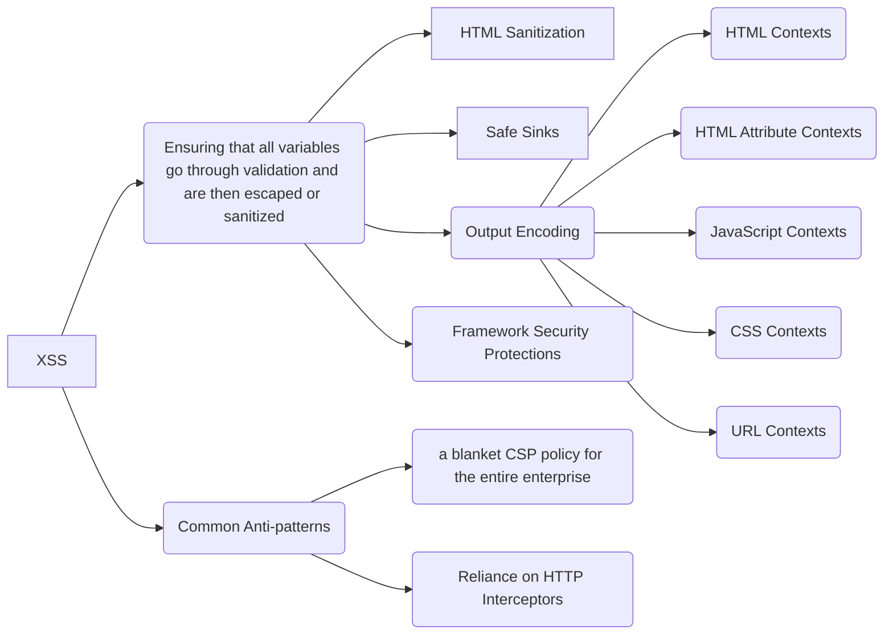

## XSS Defense Philosophy¶
In order for an XSS attack to be successful, an attacker must be able to insert and execute malicious content in a webpage. Thus, all variables in a web application needs to be protected. Ensuring that all variables go through validation and are then escaped or sanitized is known as perfect injection resistance. Any variable that does not go through this process is a potential weakness. Frameworks make it easy to ensure variables are correctly validated and escaped or sanitised.

However, no framework is perfect and security gaps still exist in popular frameworks like React and Angular. Output encoding and HTML sanitization help address those gaps.

### Output Encoding for “HTML Contexts”¶
“HTML Context” refers to inserting a variable between two basic HTML tags like a `<div> or <b>`. For example:
```html
<div> $varUnsafe </div>
```
An attacker could modify data that is rendered as `$varUnsafe`. This could lead to an attack being added to a webpage. For example:
```html
<div> <script>alert`1`</script> </div> // Example Attack
```
In order to add a variable to a HTML context safely to a web template, use HTML entity encoding for that variable.

Here are some examples of encoded values for specific characters:

If you're using JavaScript for writing to HTML, look at the `.textContent` attribute. It is a Safe Sink and will automatically HTML Entity Encode.

```html
&    &amp;
<    &lt;
>    &gt;
"    &quot;
'    &#x27;
```
### Output Encoding for “HTML Attribute Contexts”¶

```html
<div attr="$varUnsafe">
<div attr=”*x” onblur=”alert(1)*”> // Example Attack
```
**It’s critical to use quotation marks like " or ' to surround your variables.** Quoting makes it difficult to change the context a variable operates in, which helps prevent XSS. Quoting also significantly reduces the characterset that you need to encode, making your application more reliable and the encoding easier to implement.

If you're writing to a HTML Attribute with JavaScript, look at the `.setAttribute` and `[attribute]` methods because they will automatically HTML Attribute Encode. Those are Safe Sinks as long as the attribute name is hardcoded and innocuous, like `id` or `class`. Generally, attributes that accept JavaScript, such as `onClick`, are **NOT** safe to use with untrusted attribute values.

### Output Encoding for “JavaScript Contexts”¶
```html
<script>alert('$varUnsafe’)</script>
<script>x=’$varUnsafe’</script>
<div onmouseover="'$varUnsafe'"</div>
```
Encode all characters using the \xHH format. Encoding libraries often have a `EncodeForJavaScript` or similar to support this function.

For `JSON`, verify that the `Content-Type` header is `application/json` and not `text/html` to prevent XSS.

### Output Encoding for “CSS Contexts”¶

```html
<style> selector { property : $varUnsafe; } </style>
<style> selector { property : "$varUnsafe"; } </style>
<span style="property : $varUnsafe">Oh no</span>
```

If you're using JavaScript to change a CSS property, look into using `style.property = x`. This is a Safe Sink and will automatically CSS encode data in it.

When inserting variables into CSS properties, ensure the data is properly encoded and sanitized to prevent injection attacks. **Avoid placing variables directly into selectors or other CSS contexts.**

### Output Encoding for “URL Contexts”¶
```html
<a href="http://www.owasp.org?test=$varUnsafe">link</a >
```
Encode all characters with the %HH encoding format. Make sure any attributes are fully quoted, same as JS and CSS.

#### Common Mistake¶
There will be situations where you use a URL in different contexts. The most common one would be adding it to an `href` or `src` attribute of an `<a>` tag. In these scenarios, you should do URL encoding, followed by HTML attribute encoding.
```html
url = "https://site.com?data=" + urlencode(parameter)
<a href='attributeEncode(url)'>link</a>
```
If you're using JavaScript to construct a URL Query Value, look into using `window.encodeURIComponent(x)`. This is a Safe Sink and will automatically URL encode data in it.

### Dangerous Contexts¶
Output encoding is not perfect. It will not always prevent XSS. These locations are known as dangerous contexts. Dangerous contexts include:
```html
<script>Directly in a script</script>
<!-- Inside an HTML comment -->
<style>Directly in CSS</style>
<div ToDefineAnAttribute=test />
<ToDefineATag href="/test" />
```
Other areas to be careful with include:

Callback functions
- Where URLs are handled in code such as this CSS `{ background-url : “javascript:alert(xss)”; }`
- All JavaScript event handlers (`onclick()`, `onerror()`, `onmouseover()`).
- Unsafe JS functions like `eval()`, `setInterval()`, `setTimeout()`
  
Don't place variables into dangerous contexts as even with output encoding, it will not prevent an XSS attack fully.

### HTML Sanitization¶
When users need to author HTML, developers may let users change the styling or structure of content inside a WYSIWYG editor. Output encoding in this case will prevent XSS, but it will break the intended functionality of the application. The styling will not be rendered. In these cases, HTML Sanitization should be used.

HTML Sanitization will strip dangerous HTML from a variable and return a safe string of HTML. OWASP recommends `DOMPurify` for HTML Sanitization.
```javascript
let clean = DOMPurify.sanitize(dirty);
```
There are some further things to consider:
- If you sanitize content and then modify it afterwards, you can easily void your security efforts.
- If you sanitize content and then send it to a library for use, check that it doesn’t mutate that string somehow. Otherwise, again, your security efforts are void.
- You must regularly patch DOMPurify or other HTML Sanitization libraries that you use. Browsers change functionality and bypasses are being discovered regularly.

### Safe Sinks¶
Security professionals often talk in terms of sources and sinks. If you pollute a river, it'll flow downstream somewhere. It’s the same with computer security. XSS sinks are places where variables are placed into your webpage.

Thankfully, many sinks where variables can be placed are safe. This is because these sinks treat the variable as text and will never execute it. Try to refactor your code to remove references to unsafe sinks like innerHTML, and instead use textContent or value.
```javascript
elem.textContent = dangerVariable;
elem.insertAdjacentText(dangerVariable);
elem.className = dangerVariable;
elem.setAttribute(safeName, dangerVariable);
formfield.value = dangerVariable;
document.createTextNode(dangerVariable);
document.createElement(dangerVariable);
elem.innerHTML = DOMPurify.sanitize(dangerVar);
```
Safe HTML Attributes include: `align`, `alink`, `alt`, `bgcolor`, `border`, `cellpadding`, `cellspacing`, `class`, `color`, `cols`, `colspan`, `coords`, `dir`, `face`, `height`, `hspace`, `ismap`, `lang`, `marginheight`, `marginwidth`, `multiple`, `nohref`, `noresize`, `noshade`, `nowrap`, `ref`, `rel`, `rev`, `rows`, `rowspan`, `scrolling`, `shape`, `span`, `summary`, `tabindex`, `title`, `usemap`, `valign`, `value`, `vlink`, `vspace`, `width`.

For attributes not reported above, ensure that if JavaScript code is provided as a value, it cannot be executed.

### Other Controls¶
Framework Security Protections, Output Encoding, and HTML Sanitization will provide the best protection for your application. OWASP recommends these in all circumstances.

Consider adopting the following controls in addition to the above.

- Cookie Attributes - These change how JavaScript and browsers can interact with cookies. Cookie attributes try to limit the impact of an XSS attack but don’t prevent the execution of malicious content or address the root cause of the vulnerability.
- Content Security Policy - An allowlist that prevents content being loaded. It’s easy to make mistakes with the implementation so it should not be your primary defense mechanism. Use a CSP as an additional layer of defense and have a look at the cheatsheet here.
- Web Application Firewalls - These look for known attack strings and block them. WAF’s are unreliable and new bypass techniques are being discovered regularly. WAFs also don’t address the root cause of an XSS vulnerability. In addition, WAFs also miss a class of XSS vulnerabilities that operate exclusively client-side. WAFs are not recommended for preventing XSS, especially DOM-Based XSS.

### Output Encoding Rules Summary¶

The purpose of output encoding (as it relates to Cross Site Scripting) is to convert untrusted input into a safe form where the input is displayed as data to the user without executing as code in the browser. The following charts provides a list of critical output encoding methods needed to stop Cross Site Scripting.

Encoding Type: HTML Entity Encoding Mechanism: Convert `&` to `&amp;`, Convert `<` to `&lt;`, Convert `>` to `&gt`;, Convert `"` to `&quot;`, Convert `'` to `&#x27`;

Encoding Type: HTML Attribute Encoding Mechanism: Encode all characters with the HTML Entity `&#xHH;` format, including spaces, where `HH` represents the hexadecimal value of the character in Unicode. For example, `A` becomes `&#x41;`. All alphanumeric characters (letters `A` to `Z`, `a` to `z`, and digits `0` to `9`) remain unencoded.

Encoding Type: URL Encoding Encoding Mechanism: Use standard percent encoding, as specified in the W3C specification, to encode parameter values. Be cautious and only encode parameter values, not the entire URL or path fragments of a URL.

Encoding Type: JavaScript Encoding Encoding Mechanism: Encode all characters using the Unicode `\uXXXX` encoding format, where `XXXX` represents the hexadecimal Unicode code point. For example, `A` becomes `\u0041`. All alphanumeric characters (letters `A` to `Z`, `a` to `z`, and digits `0` to `9`) remain unencoded.

Encoding Type: CSS Hex Encoding Encoding Mechanism: CSS encoding supports both `\XX` and `\XXXXXX` formats. To ensure proper encoding, consider these options: (a) Add a space after the CSS encode (which will be ignored by the CSS parser), or (b) use the full six-character CSS encoding format by zero-padding the value. For example, `A` becomes `\41` (short format) or `\000041` (full format). Alphanumeric characters (letters `A` to `Z`, `a` to `z`, and digits `0` to `9`) remain unencoded.

### Common Anti-patterns: Ineffective Approaches to Avoid

#### Sole Reliance on Content-Security-Policy (CSP) Headers¶
First, let us be clear, we are a strong proponent of CSP when it is used properly. In the context of XSS defense, CSP works best when it it is:

- Used as a defense-in-depth technique.
- Customized for each individual application rather than being deployed as a one-size-fits-all enterprise solution.
What we are against is a blanket CSP policy for the entire enterprise. Problems with that approach are:

##### Problem 1 - Assumption Browser Versions Support CSP Equally¶
There usually is an implicit assumption that all the customer browsers support all the CSP constructs that your blanket CSP policy is using. Furthermore, this assumption often is done without testing the explicitly the `User-Agent` request header to see if it indeed is a supported browser type and rejecting the use of the site if it is not. Why? Because most businesses don't want to turn away customers if they are using an outdated browser that doesn't support some CSP Level 2 or Level 3 construct that they are relying on for XSS prevention. (Statistically, almost all browsers support CSP Level 1 directives, so unless you are worried about Grandpa pulling out his old Windows 98 laptop and using some ancient version of Internet Explorer to access your site, CSP Level 1 support can probably be assumed.)

##### Problem 2 - Issues Supporting Legacy Applications¶
Mandatory universal enterprise-wide CSP response headers are inevitably going to break some web applications, especially legacy ones. This causes the business to push-back against AppSec guidelines and inevitably results in AppSec issuing waivers and/or security exceptions until the application code can be patched up. But these security exceptions allow cracks in your XSS armor, and even if the cracks are temporary they still can impact your business, at least on a reputational basis.
---

XSS（跨站脚本攻击）根据攻击方式和恶意脚本的存储位置，主要分为以下三种类型，每种类型的攻击原理和防御措施如下：

---

### **1. 反射型XSS（Reflected XSS）**
#### **攻击原理**：
- 攻击者将恶意脚本嵌入到URL参数中，诱导用户点击该链接。
- 用户点击后，服务器将恶意脚本作为响应内容返回给浏览器，浏览器解析并执行脚本。
- **特点**：脚本未存储在服务器，仅在用户点击时临时“反射”执行（非持久型）。

#### **常见场景**：
- 搜索结果页、错误页面、动态生成的URL等。

#### **防御措施**：
1. **输入过滤与验证**：
   - 对用户输入的特殊字符（如 `<`, `>`, `&`, `"` 等）进行过滤或转义。
   - 使用白名单策略，仅允许合法的字符和格式。
2. **输出编码**：
   - 在将用户输入内容渲染到页面时，根据上下文进行编码：
     - **HTML编码**：将 `<` 转为 `&lt;`，`>` 转为 `&gt;`。
     - **JavaScript编码**：对字符串中的特殊字符进行转义（如 `\`）。
3. **设置 HTTP 头部防护**：
   - 启用浏览器的内置防护机制，例如：
     ```http
     X-XSS-Protection: 1; mode=block
     ```
   - 配置 **Content Security Policy (CSP)**，限制脚本的来源：
     ```http
     Content-Security-Policy: script-src 'self'
     ```

---

### **2. 存储型XSS（Stored XSS）**
#### **攻击原理**：
- 攻击者将恶意脚本提交到服务器（如论坛、评论区、用户资料等），存储在数据库中。
- 当其他用户访问相关页面时，服务器返回包含恶意脚本的内容，浏览器执行脚本。
- **特点**：脚本持久化存储，影响范围广（持久型）。

#### **常见场景**：
- 社交平台、论坛、博客评论、用户个人资料等。

#### **防御措施**：
1. **严格输入验证**：
   - 对用户提交的文本、表单数据进行严格的格式校验，拒绝非法字符。
   - 使用自动化工具（如 OWASP ESAPI）过滤输入。
2. **输出编码**：
   - 在渲染用户提交的内容时，始终进行上下文相关的编码（HTML、JavaScript、URL 等）。
3. **最小权限原则**：
   - 限制用户提交内容的存储范围（如禁止直接存储 HTML 代码）。
4. **CSP 配置**：
   - 通过 CSP 限制脚本的加载源，防止非授权脚本执行。
5. **定期漏洞扫描**：
   - 对存储用户数据的字段进行安全审计，检查是否存在未处理的 XSS 漏洞。

---

### **3. DOM 型 XSS（DOM-based XSS）**
#### **攻击原理**：
- 攻击者通过修改页面的 DOM 环境（如 URL 哈希值、`document.write` 等），直接在客户端注入恶意脚本。
- **特点**：无需服务器参与，完全在客户端执行（客户端型）。

#### **常见场景**：
- 动态修改 DOM 的 JavaScript 代码（如通过 `innerHTML`、`eval`、`document.write` 等）。

#### **防御措施**：
1. **避免直接操作 DOM**：
   - 不使用 `innerHTML` 或 `document.write` 直接插入用户输入的内容。
   - 使用安全的 DOM 操作方法（如 `textContent`）。
2. **输入验证与编码**：
   - 对 URL 参数、表单数据等用户输入内容进行验证和编码。
3. **禁用危险函数**：
   - 避免使用 `eval`、`new Function` 等动态执行代码的函数。
4. **CSP 配置**：
   - 限制内联脚本的执行：
     ```http
     Content-Security-Policy: script-src 'self'; 
     ```
5. **使用安全框架**：
   - 使用前端框架（如 React、Vue）的内置安全机制（如自动转义 JSX 内容）。

---

### **通用防御策略**
1. **输入处理**：
   - 所有用户输入都需经过过滤和验证，避免直接输出到页面。
2. **输出编码**：
   - 根据输出上下文（HTML、JavaScript、CSS、URL）选择合适的编码方式。
3. **CSP（内容安全策略）**：
   - 通过 HTTP 头部配置 CSP，限制脚本、样式等资源的加载源。
4. **Cookie 安全设置**：
   - 为 Cookie 设置 `HttpOnly` 和 `Secure` 属性，防止通过 JavaScript 访问敏感信息。
5. **安全开发实践**：
   - 使用安全的开发框架（如 Django、Spring Security）内置的 XSS 防护功能。
   - 定期进行代码审计和渗透测试。

---

### **总结**
| **XSS 类型** | **攻击特点**         | **防御重点**                     |
|--------------|----------------------|----------------------------------|
| 反射型       | 临时性，需诱导点击   | 输入过滤、输出编码、CSP          |
| 存储型       | 持久性，影响广泛     | 严格输入验证、CSP、定期扫描      |
| DOM 型       | 客户端执行，无需服务 | 避免直接操作 DOM、禁用危险函数   |

通过结合输入验证、输出编码、CSP 配置和安全开发实践，可以有效降低 XSS 攻击的风险。

`X-XSS-Protection: 1; mode=block` 是一个 HTTP 响应头，用于启用浏览器内置的 **XSS 过滤器**，并通过配置其行为来增强对 **反射型 XSS**（跨站脚本攻击）的防护。以下是其原理和防御机制的详细解析：

---

### **1. 原理**
#### **(1) XSS 过滤器的触发条件**
当浏览器接收到包含 `X-XSS-Protection: 1; mode=block` 的 HTTP 响应头时，会激活内置的 XSS 过滤器。该过滤器的核心逻辑是：
- **检测潜在恶意脚本**：浏览器会分析服务器返回的 HTML 内容，检查是否存在符合 XSS 攻击特征的代码（例如 `<script>` 标签、`onerror` 事件、`javascript:` 伪协议等）。
- **判断脚本来源**：过滤器会评估脚本是否来自用户提交的数据（例如 URL 参数、表单输入等），而非服务器正常生成的代码。

#### **(2) `mode=block` 的行为**
- **阻断页面加载**：如果检测到潜在的 XSS 攻击，浏览器会直接 **阻止页面渲染**，而不是尝试修复或移除恶意代码。
- **用户提示**：部分浏览器可能会显示错误信息（例如 "This page is not safe to load"），提醒用户存在安全风险。

---

### **2. 为什么能抵御 XSS 攻击？**
#### **(1) 针对反射型 XSS 的防护**
反射型 XSS 的典型攻击流程是：
1. 攻击者构造恶意链接（例如：`http://example.com/search?q=<script>alert('XSS')</script>`）。
2. 用户点击链接后，服务器将恶意脚本作为响应内容返回给浏览器。
3. 浏览器解析并执行恶意脚本。

**`X-XSS-Protection: 1; mode=block` 的作用**：
- **检测恶意脚本**：浏览器发现 `<script>alert('XSS')</script>` 是用户提交的参数（非服务器生成的合法代码），触发 XSS 过滤器。
- **阻断页面加载**：浏览器直接拒绝渲染页面，防止恶意脚本执行，从而保护用户。

#### **(2) 对存储型 XSS 和 DOM 型 XSS 的局限性**
- **存储型 XSS**：恶意脚本已存储在服务器端（例如数据库），浏览器无法通过响应头检测到攻击。
- **DOM 型 XSS**：攻击完全发生在客户端（例如通过修改 DOM 环境），不依赖服务器响应内容，因此 `X-XSS-Protection` 无法检测。

---

### **3. 技术细节**
#### **(1) 浏览器支持**
- **历史背景**：`X-XSS-Protection` 最初由 Microsoft 在 Internet Explorer 8 中引入，随后被 Chrome、Edge 等浏览器支持。
- **现代浏览器的兼容性**：
  - **Chrome/Edge**：支持 `1; mode=block`，但后续版本逐步弱化该功能（推荐使用 Content Security Policy, CSP）。
  - **Firefox/Safari**：未完全支持 `X-XSS-Protection`，依赖其他安全机制（如 CSP）。

#### **(2) 配置示例**
```http
X-XSS-Protection: 1; mode=block
```
- **效果**：启用 XSS 过滤器，并在检测到攻击时阻止页面加载。

---

### **4. 局限性**
1. **仅防御反射型 XSS**：
   - 无法防御存储型 XSS（脚本持久化存储在服务器）。
   - 无法防御 DOM 型 XSS（攻击完全在客户端发生）。
2. **依赖浏览器实现**：
   - 不同浏览器的 XSS 检测逻辑可能不同，存在误报或漏报的风险。
   - 现代浏览器逐步弃用该功能，转而推荐使用 **Content Security Policy (CSP)**。
3. **不能替代其他防御措施**：
   - 必须结合 **输入验证**、**输出编码** 和 **CSP** 等多层防护策略。

---

### **5. 与 Content Security Policy (CSP) 的对比**
| **特性**               | **X-XSS-Protection**                     | **Content Security Policy (CSP)**                |
|------------------------|------------------------------------------|--------------------------------------------------|
| **防御范围**           | 仅反射型 XSS                             | 所有类型的 XSS（反射型、存储型、DOM 型）        |
| **实现方式**           | 浏览器内置过滤器                         | 通过 HTTP 响应头定义资源加载规则                |
| **灵活性**             | 固定规则（仅能启用/禁用）                | 可自定义策略（如限制脚本来源、样式表等）        |
| **现代浏览器支持**     | 逐步弃用                                 | 广泛支持（Chrome、Firefox、Safari、Edge 等）    |
| **推荐使用**           | 否                                       | 是（更全面的防护）                              |

---

### **6. 实际应用建议**
1. **启用 `X-XSS-Protection: 1; mode=block`**：
   - 作为防御反射型 XSS 的补充措施，尤其在支持旧版浏览器时。
   - 在服务器配置中添加该响应头（例如 Nginx、Apache、Flask/Django 等框架）。
2. **优先使用 Content Security Policy (CSP)**：
   ```http
   Content-Security-Policy: default-src 'self'; script-src 'self'
   ```
   - 通过限制脚本加载源，彻底阻止恶意脚本执行。
3. **多层防御**：
   - 结合 **输入验证**、**输出编码** 和 **HttpOnly Cookie**，形成完整的 XSS 防护体系。

---

### **总结**
`X-XSS-Protection: 1; mode=block` 通过浏览器内置的 XSS 过滤器，在检测到反射型 XSS 攻击时直接阻断页面加载，从而防止恶意脚本执行。然而，它仅能作为辅助防护手段，不能替代更强大的 **Content Security Policy (CSP)** 和 **输入/输出安全处理**。现代安全实践建议以 CSP 为核心，结合其他防御措施，构建多层安全防护体系。